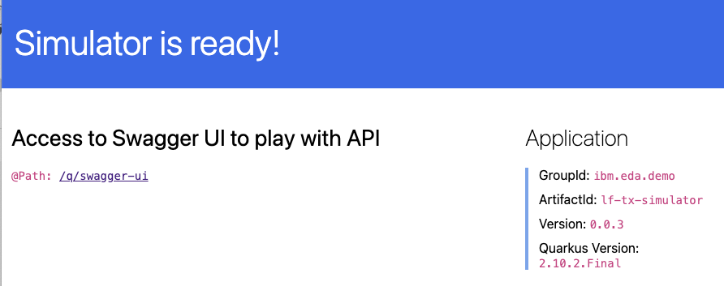
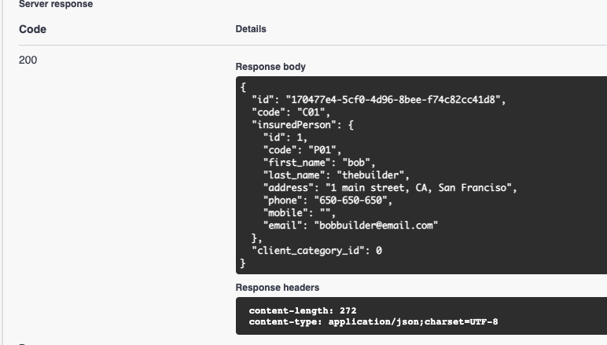
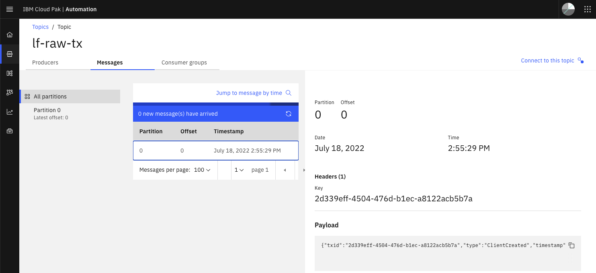

# Demonstration Script

## Goal

The goal of the demonstration is to send two messages to illustrate client creation and update message in this order. Then each message is enriched and routed to different topics.

The sequence of business operations:

* Bob TheBuilder is a new client so a web app is creating the record via a POST operation to the client management simulator
* The client record is updated by adding a beneficiary as spouce
* Then email address is changed.

We can do two type of environment:

* [Local on your laptop using docker compose](#local-execution-demonstration)
* [Once deployed on OpenShift with Event Streams and MQ](#openshift-deployment-demonstration)
## Local execution demonstration

1. Pre-requisites

    * You have docker desktop or similar installed on your laptop.

1. Under the project starts docker compose:

```sh
docker-compose up -d
```

1. Verify the existing topics are empty 


    ```sh
    chrome http://localhost:9000/
    ```

    


1. Configure MQ Source connector

    ```sh
    cd environments/local
    ./sendMQSrcConfig.sh
    ```

1. Send a new client creation command

    ```sh
    # under home
    ./e2e/local/sendTxToSimulator.sh ./e2e/data/client-bob.json
    ```

## OpenShift Deployment demonstration

1. Pre-requisites

    * You have te `make` tool

1. Deploy the solution with one commmand

    ```sh
    cd environments
    make all
    ```

    You should get the following outcome:

    ```
    ```

1. Verify your environments

    * Verify MQ source connector is ready

    ```sh
    oc get kafkaconnectors  
    # Output>
    # NAME        CLUSTER                CONNECTOR CLASS                                           MAX TASKS   READY
    # mq-source   eda-kconnect-cluster   com.ibm.eventstreams.connect.mqsource.MQSourceConnector   1           True
    ```

    * Deeper view of the connector

    ```sh
    oc describe kafkaconnector mq-source
    ```


1. Access the Simulator App


    

1. Access the Simulator APIs by clicking on q/swagger-ui link from the home page:

    

1. Use the POST on `/api/v1/clients` to send a client creation command with the following data:

    ```json
        "id": "101012",
        "code": "C02",
        "insuredPerson": {
            "id": 2,
            "code": "P02",
            "first_name": "julie",
            "last_name": "thesimmer",
            "address": "10 market street, CA, San Franciso",
            "phone": "650-650-650",
            "mobile": "",
            "email": "jswimmer@email.com"
        }, 
        "client_category_id": 0
    ```

    The request:

    

    The response with a populated id:

    

1. Verify the message reaches the Kafka topic named `lf-raw-tx`

    